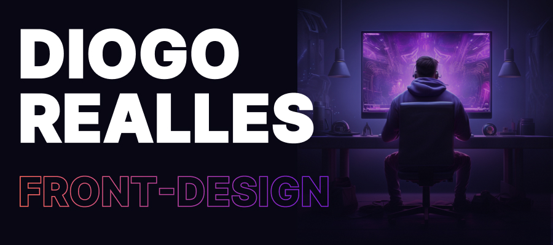

# 👋 **[Diogo Realles 🡽](https://www.linkedin.com/in/diogorealles)**
### **Desenvolvedor Front-end** | **UI Designer**

# 🎮 Sobre mim
lorem...

# ☠️ Objetivo
Desenvolvedor Web Front-end - UI Designer

# 🤖 Skills
Minhas habilidades de Front-end e UI Designer

 ⭐ ⭐ ⭐ ⭐ ⭐ (5/5)  

 ⭐ ⭐ ⭐ ⭐ ⭐ (5/5)  

 ⭐ ⭐ ⭐ ⭐ (4/5)  

 ⭐ ⭐ ⭐ ⭐ ⭐  (5/5)  

 ⭐ ⭐ ⭐  (3/5)  

 ⭐ ⭐ ⭐ (3/5)  

 ⭐ ⭐ (2/5)  

 ⭐ ⭐ ⭐ ⭐ (4/5)  

 ⭐ ⭐ ⭐ ⭐ (4/5)  

 ⭐ ⭐ ⭐ ⭐ ⭐ (5/5)  

 ⭐ ⭐ ⭐ ⭐ ⭐ (5/5)  

 ⭐ ⭐ (2/5)  

 ⭐ ⭐ (2/5)  

 ⭐ ⭐ (2/5)  

# 🎓 Formação
- **UIBOOST:** 80 horas  
  Conceitos e Teoria do Design, Tipografia, Cores, Grid, Variáveis, Componentes, Styleguide  
  **Projetos:** UI Landing Page Banco Neon  
  
- **CodeBOOST:** 80 horas  
  HTML5, CSS3, JS, WordPress  
  **Projetos:** Landing Page Banco Neon, LP Blizzard, LP com API Pokémin  
  
- **Rocketseat:** 180 horas  
  React, Next.JS, NodeJS  
  **Projetos:** API RocketNotes, RocketShop  
  
- **B7Web:** 200 horas  
  HTML5, CSS3, JS, TS, NodeJS, MySQL  
  **Projetos:** IMC com React e TS  
  
- **Matheus Battisti:** 60 horas  
  HTML5, CSS3, SASS, JS, Bootstrap, React, NodeJS, MySQL  
  **Projetos:** MVC Toughts  

# 🚀 Experiência Profissional
Minhas experiências de trabalho profissional

| [**id360 New Media**](https://www.id360.com.br/) • 2023 - Atualmente Full-time | [**Agência Moustache**](https://agenciamoustache.com.br/) • 2020 - 2022 Full-time | [**GMM TI**](https://gmmti.com.br/) • 2019 - 2020 Full-time |
| :---         |     :---:      |          ---: |
| Desenvolvedor Web Front-end   | Desenvolvedor Web Front-end     | Desenvolvedor Web Front-end    |
| Landing Pages     | Landing Pages       | Landing Pages      |
| HTML5, CSS3, SASS, TAILWINDCSS, JS, TS, NEXT.JS, FIGMA     | HTML5, CSS3, SASS, JS, BOOSTSTRAP, WORDPRESS, JQUERY, FIGMA      | HTML5, CSS3, SASS JS BOOSTSTRAP      |
| [Omini - Studio 27](https://lp-studio27.vercel.app/)   [Quinta da Baroneza](https://planodiretor-baroneza.vercel.app/)   [Reserva Terrara](https://www.reservaterrara.com.br/)     | [Level Up! Games](https://br.leveluplatam.com/marketing/)   [TBNet - Grupo TecBan](https://www.tbnet.com.br/)      | [Website Institucional](https://www.gmmti.com.br/)      |

# 👽 Idiomas
- **Portugês:** Nativo
- **Inglês:** Básico

# 📞 Contate-me

   &nbsp;
   &nbsp;

